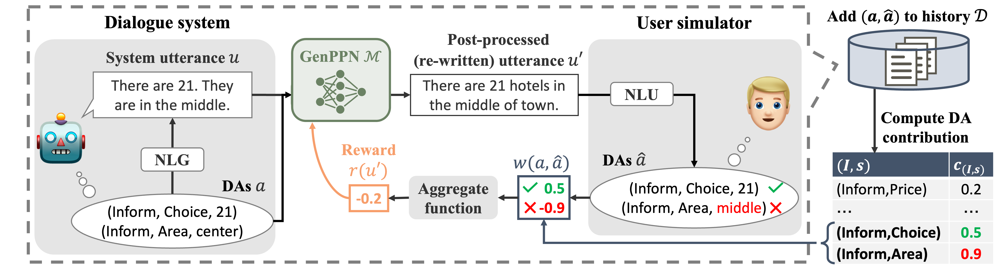

# GenPPN
This repository maintains code for EMNLP 2023 paper:

Enhancing Task-oriented Dialogue Systems with Generative Post-processing Networks [[Paper](https://aclanthology.org/2023.emnlp-main.231/)]

<p align="center" width="100%">
  <a ></a>
</p>

**Abstract:**
Recently, post-processing networks (PPNs), which modify the outputs of arbitrary modules including non-differentiable ones in task-oriented dialogue systems, have been proposed. PPNs have successfully improved the dialogue performance by post-processing natural language understanding, dialogue state tracking, and dialogue policy modules with a classification-based approach. However, they cannot be applied to natural language generation (NLG) modules because the post-processing of the utterance output by the NLG module requires a generative approach. In this study, we propose a new post-processing component for NLG, generative post-processing networks (GenPPNs). For optimizing GenPPNs via reinforcement learning, the reward function incorporates dialogue act contribution, a new measure to evaluate the contribution of GenPPN-generated utterances with regard to task completion in dialogue. Through simulation and human evaluation experiments based on the MultiWOZ dataset, we confirmed that GenPPNs improve the task completion performance of task-oriented dialogue systems.

## Setup
- Python requirement
    - Python >= 3.9

1. Clone this repository with a submodule (ConvLab-2)
    ```bash
    git clone --recursive git@github.com:nu-dialogue/GenPPN.git
    cd GenPPN
    ```

2. Install requirements
    - Make sure to specify the suitable version of `torch` in `requirements.txt` for your environment.
    - Install
        ```bash
        pip install -r requirements.txt
        ```

3. Install ConvLab-2
    - Comment out the following requirements in `ConvLab-2/setup.py` for avoiding conflict.
        ```python
        'torch>=1.2.0,<1.6.0',
        'scikit-learn==0.20.3',
        'transformers>=2.3.0,<3.0.0',
        'tensorboardX==1.7',
        'overrides==4.1.2',
        'allennlp==0.9.0',
        'spacy==2.1.9',
        ```
    - Install 
        ```bash
        cd ConvLab-2
        pip install -e .
        cd ../
        ```

## Reproduce
To accelerate dialogue sampling, we used multi-node, multi-GPU parallel computing through MPI on HPC. In this document, we present the run commands with `mpirun`, but DDP with `torchrun` or huggingface `accelerate launch` can also be used by removing the `--dist_type mpi` argument. Also, in the following, the experimental procedure using SC-GPT is described, but you can experiment with different NLG models by changing `--system_nlg_name`. Further details of the arguments can be found by using `--help`.

> [!NOTE]
> The specific HPC job script we used can be found in `job_scripts/` directory.

> [!WARNING]
> Different hyperparameters from this example, including the number of GPUs, will likely not reproduce the results on our paper.

### 1. Setup modules in ConvLab-2
We need to setup the following modules, which need to be trained or require pre-trained checkpoints. Please see the instructions in README.md in the directory of each model.
| Module | Models (link to README.md) |
| --- | --- |
| User NLU | [BERT NLU](user_simulator/nlu/bert) |
| System NLU | [BERT NLU](system/nlu/bert) |
| System NLG | [SC-LSTM](system/nlg/sclstm), [SC-GPT](system/nlg/scgpt), [GPT2 + RL](system/nlg/gpt2rl), [Template](system/nlg/template) |

### 2. (Optional) Test baseline system
Evaluate the baseline system by using 1024 test dialogues (8 process x 128 dialogues).
```bash
RUN_DPATH="outputs/baseline_test/sys_scgpt"

mpirun -n 8 -machinefile $PJM_O_NODEINF -display-devel-map -map-by ppr:2:socket \
    python run_baseline_system.py \
        --dist_type mpi \
        --run_dpath $RUN_DPATH \
        --system_nlg_name scgpt_nlg \
        --do_test
```
The result scores will be saved to `$RUN_DPATH/eval_summary.json`.

### 3. Sample dialogue data to initialize DA contribution
Sample 16k turns (2000 turns x 8 processes), equivalent to at least 1k dialogues, of dialogue data from the baseline system prior to PPO training.
```bash
RUN_DPATH="outputs/dialogue_data/sys_scgpt"

mpirun -n 8 -machinefile $PJM_O_NODEINF -display-devel-map -map-by ppr:2:socket \
    python run_baseline_system.py \
        --dist_type mpi \
        --run_dpath $RUN_DPATH \
        --system_nlg_name scgpt_nlg \
        --turns_per_process 2000
```
The sampled dialogues will be saved to `$RUN_DPATH/dialogues/*`.

### 4. PPO training of GenPPN
Fine-tune Alpaca 7B (using 16 x V100 32GB GPUs). The learning curves will be tracked by wandb.

> [!NOTE]
> The actual training logs of GenPPN for each NLG model can be found in [this wandb project](https://wandb.ai/ohashi56225/genppn-emnlp2023).

```bash
# Specify the path to output directory
RUN_DPATH="outputs/rl/sys_scgpt-absmax"

# Run
mpirun -n 16 -machinefile $PJM_O_NODEINF -display-devel-map -map-by ppr:2:socket \
    python run_rl_alpaca_lora.py \
        --dist_type mpi \
        --run_dpath $RUN_DPATH \
        --system_nlg_name scgpt_nlg \
        --base_model_name ohashi56225/alpaca-7b \
        --wandb_project_name genppn-emnlp2023 \
        --do_train \
        --total_iterations 200 \
        --batch_size_per_device 32 \
        --mini_batch_size_per_device 2 \
        --gradient_accumulation_steps 2 \
        --num_epochs 4 \
        --learning_rate 1e-5 \
        --reward_factors da_contribution_absmax \
        --adaptive_dac \
        --dac_dialogue_dpath_to_init "outputs/dialogue_data/sys_scgpt/dialogues" \
        --dac_num_dialogues_to_init 1000
```
This will save the trained checkpoints to `$RUN_DPATH/checkpoints/*`.

### 5. Test GenPPN
Select the checkpoint with the best Task Success from the wandb learning curve and test it.
```bash
# Specify the trained model path
ADAPTER_DPATH="outputs/rl/sys_scgpt-absmax/checkpoints/iteration-150"

# Run
mpirun -n 16 -machinefile $PJM_O_NODEINF -display-devel-map -map-by ppr:2:socket \
    python run_rl_alpaca_lora.py \
        --dist_type mpi \
        --run_dpath $ADAPTER_DPATH \
        --system_nlg_name scgpt_nlg \
        --base_model_name ohashi56225/alpaca-7b \
        --adapter_checkpoint_path $ADAPTER_DPATH \
        --do_test
```
This will save the sampled dialogues to `$ADAPTER_DPATH/test_dialogues/*` and the result scores to `$ADAPTER_DPATH/test_summary.json`.

## Citation
```bibtex
@inproceedings{ohashi-higashinaka-2023-enhancing,
    title = "Enhancing Task-oriented Dialogue Systems with Generative Post-processing Networks",
    author = "Ohashi, Atsumoto and Higashinaka, Ryuichiro",
    booktitle = "Proceedings of the 2023 Conference on Empirical Methods in Natural Language Processing",
    year = "2023",
    url = "https://aclanthology.org/2023.emnlp-main.231",
    pages = "3815--3828",
}
```
